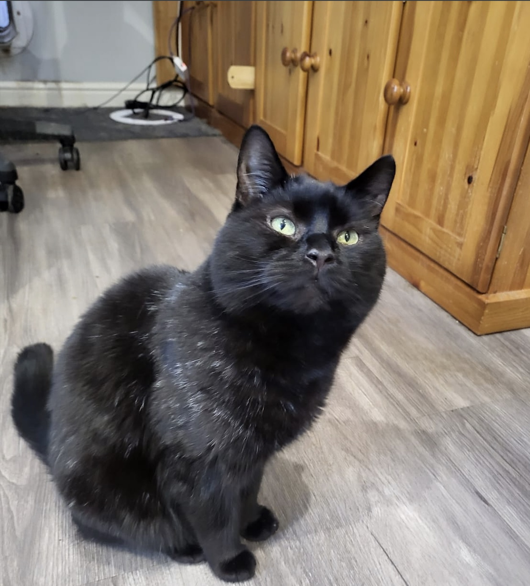
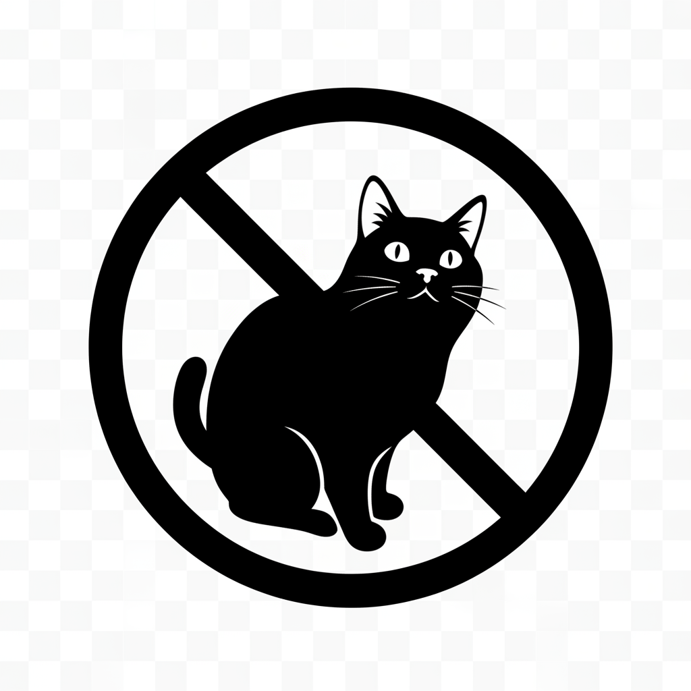
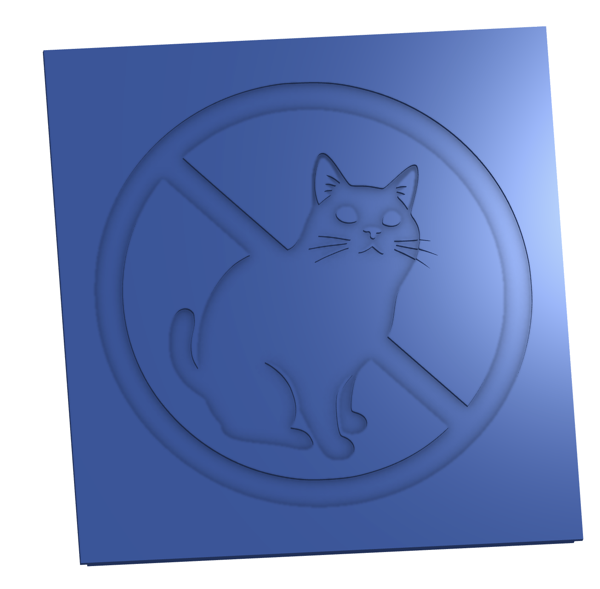

Designed in OnShape

https://cad.onshape.com/documents/f4b5a88bad5686f9d68e4276/w/19fd6644adc7253050f139b0/e/89d52341bea3467f4a4d6d62


For the "No Boots" image on thid lid of the box, I started with the following image:




I then converted the image to something suitable for 3d printing using an AI image generator [Envanto](https://labs.envato.com/apps/image-gen/) with the following prompt

```
The image should be an svg, black-and-white only (no greyscale), and should be slightly cartoonish. I'll be 3d-printing it on a surface, so it'll can't have too much fine detail. Also please add a circle round it with a bar - in a "No Cats!" style
```

Envanto can only produce scalars, but the resulting .png was very suitable for conversion to 3d



I then used [imagemagick](https://imagemagick.org/) and [potrace](https://potrace.sourceforge.net/) to convert the image to .svg

```
magick bootboots.png -alpha remove -alpha off -threshold 50%
      bootboots.pbm && potrace bootboots.pbm -s -o bootboots.svg && rm
      bootboots.pbm
```

Once that was done, I then used [OpenSCAD](https://openscad.org/) to convert the svg to a 3d stl

```
linear_extrude(height = 1)
    import("bootboots.svg", center = true);
```

Once I had the stl, I could then import it into [OnShape](https://www.onshape.com/) and apply it to [my model](https://cad.onshape.com/documents/f4b5a88bad5686f9d68e4276/w/19fd6644adc7253050f139b0/e/29b19d4383800b594f26c8da)


