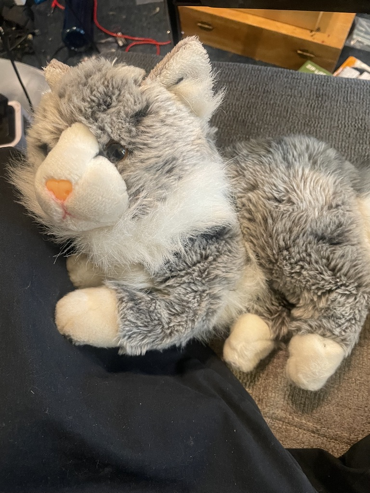

# BootBoots - Autonomous Cat Territory Management System

An IoT system using an ESP32-S3 CAM device with AI-powered cat recognition and a humane deterrent mechanism. The system identifies specific cats and can activate deterrents to manage cat territory boundaries.

## Table of Contents

<!-- toc -->

- [Overview](#overview)
- [Architecture Diagram](#architecture-diagram)
- [Components](#components)
  * [Embedded Firmware](#embedded-firmware)
  * [AWS Infrastructure](#aws-infrastructure)
  * [Documentation](#documentation)
  * [Utilities](#utilities)
- [Supported Hardware](#supported-hardware)
  * [Primary: ESP32-S3 WROOM N16R8 CAM](#primary-esp32-s3-wroom-n16r8-cam)
  * [Legacy: ESP32-CAM AI-Thinker](#legacy-esp32-cam-ai-thinker)
- [Project Structure](#project-structure)
- [Quick Start](#quick-start)
  * [Prerequisites](#prerequisites)
  * [Initial Device Setup](#initial-device-setup)
  * [OTA Updates (Preferred)](#ota-updates-preferred)
- [Cat Safety Logic](#cat-safety-logic)
- [Related Projects](#related-projects)
- [License](#license)

<!-- tocstop -->

## Overview

We have four cats. Our neighbour also has a cat — Mr Boots — who has worked out that our cat flap is unlocked and that our cats' food bowl is, from his perspective, a free buffet. For a while the solution was shooing him out whenever we spotted him, but he's persistent, fast, and frankly quite smug about the whole thing. So I built this.

Meet the culprit. Boots is a sleek all-black cat with bright green eyes and an expression of complete innocence that frankly cannot be trusted.

<div align="center"><br/><em>Mr Boots — looking like he's never stolen a meal in his life</em></div>

The system needs to tell Boots apart from our own cats, who are allowed in and must never be on the receiving end of a water mist. Introducing the household:

|  |  |  |
|:---:|:---:|:---:|
| **Chi** — long-haired dark tabby; patriarch of the family and apparently very interested in electronics | **Tau** — black and white tuxedo; perches in high places and judges everyone | **Kappa** — Chi and Tau's son; inherited his dad's fur and his mum's attitude |
|  |  | |
| **Mu** — fluffy ginger/cream with a permanently regal expression | **Wolf** — not a real cat; a stuffed toy pressed into service as a test subject because he's much easier to pose than the others | |

The AI model is trained to recognise Boots versus NotBoots (everyone else, including no-cat frames), so the system only fires the water mist when it's confident the visitor is Boots. The whole pipeline — camera capture, cloud inference via a SageMaker model, and a deterrent sequence of LEDs and a short water mist — runs autonomously. Boots has so far remained unimpressed, but the data is promising.


## Architecture Diagram


## Components

### Embedded Firmware

The [embedded](embedded) directory contains Arduino-based firmware for ESP32 camera devices:

- **[bootloader](embedded/bootloader)** - Factory bootloader that checks for pending OTA updates on every boot. Enables single-partition OTA architecture for maximum firmware space.

- **[catcam](embedded/catcam)** - Main application with camera capture, WiFi, Bluetooth LE, SD card logging, and AI inference integration. Includes 15+ custom libraries:
  - `BluetoothOTA` - Bluetooth-based OTA control
  - `BluetoothService` - Device status monitoring and image transfer via BLE
  - `Camera` - Image capture and PSRAM buffer management
  - `CaptureController` - Capture orchestration
  - `CatCamHttpClient` - HTTPS POST to AWS SageMaker inference API
  - `ImageStorage` - Image file management
  - `InputManager` - Button and input handling
  - `LedController` - RGB LED control
  - `NeoPixel` - WS2812 LED driver
  - `OTAUpdate` - Two-stage OTA update mechanism
  - `PCF8574Manager` - I2C GPIO expander control
  - `SDLogger` - Thread-safe SD card logging with FreeRTOS mutex
  - `SystemManager` - System state management
  - `VideoRecorder` - MJPEG video recording to SD card
  - `WifiConnect` - WiFi connection management

The bootloader-based OTA architecture maximises available flash space by using a single large application partition (7MB on ESP32-S3) instead of the traditional dual-partition approach.

### AWS Infrastructure

The [infra](infra) directory contains AWS CDK stacks (TypeScript) for cloud services:

- **IoT Device Stack** - AWS IoT Thing provisioning, certificate generation, and SSM Parameter Store integration
- **API Gateway Stack** - REST API endpoints for device communication
- **Firmware Cleanup Stack** - Lambda function that manages firmware versions in S3, keeping only the 3 most recent versions and auto-updating the manifest

### Documentation

The [docs](docs) directory contains architecture diagrams:

- `architecture/architecture-deterrence.drawio` - Live deterrence system architecture
- `architecture/architecture-training.drawio` - ML training pipeline architecture

SVG versions are auto-generated via pre-commit hook when `.drawio` files change.

### Utilities

The [scripts](scripts) directory contains:

- `install-hooks.sh` - Git hooks installation script

The [githooks](githooks) directory contains git hooks for auto-generating architecture SVGs and TOC updates.

## Supported Hardware

### Primary: ESP32-S3 WROOM N16R8 CAM

| Feature | Specification |
|---------|---------------|
| Chipset | ESP32-S3 (dual-core 240MHz Xtensa LX7) |
| Flash | 16MB (QSPI) |
| PSRAM | 8MB (Octal SPI) |
| Camera | OV5640 (5MP, autofocus) |
| LED | WS2812 RGB addressable (GPIO 48) |
| Storage | microSD card slot |

### Legacy: ESP32-CAM AI-Thinker

| Feature | Specification |
|---------|---------------|
| Flash | 4MB |
| PSRAM | 4MB |
| Camera | OV2640 (2MP) |

## Project Structure

```
bootboots/
├── docs/
│   └── architecture/          # System architecture diagrams (.drawio + .svg)
│
├── embedded/
│   ├── bootloader/            # Factory bootloader (OTA staging)
│   ├── catcam/                # Main camera application
│   │   ├── include/           # Header files
│   │   ├── lib/               # Custom libraries (15+)
│   │   ├── scripts/           # Build and deployment scripts
│   │   └── src/               # Main application source
│   ├── CLAUDE.md              # Detailed technical context
│   └── README.md              # Embedded firmware documentation
│
├── githooks/                  # Git hooks for automation
│
├── infra/                     # AWS CDK infrastructure (TypeScript)
│   ├── lib/                   # CDK stack definitions
│   └── lambda/                # Lambda function code
│
├── scripts/                   # Project-wide utility scripts
│
└── README.md                  # This file
```

## Quick Start

### Prerequisites

- Python 3.8+
- PlatformIO CLI
- Node.js and npm (for infrastructure)
- AWS CLI configured with `nakom.is-sandbox` profile
- draw.io desktop app (for architecture diagram generation)
- githooks installed using `./scripts/install-hooks.sh`

### Initial Device Setup

1. **Generate secrets** from AWS SSM Parameter Store:
   ```bash
   cd embedded/catcam
   export AWS_PROFILE=nakom.is-sandbox
   python3 scripts/generate_secrets.py
   ```

2. **Build and flash** (USB - for factory-new devices):
   ```bash
   cd embedded/catcam
   ./scripts/factory_setup.sh /dev/cu.usbserial-XXXX
   ```

See [embedded/README.md](embedded/README.md) for detailed setup instructions.

### OTA Updates (Preferred)

Once a device is set up, use OTA updates via Bluetooth:

```bash
cd embedded/catcam
export AWS_PROFILE=nakom.is-sandbox
python3 scripts/build_and_upload.py
```

Then use the web interface to push the update to the device via Bluetooth.

## Cat Safety Logic

The deterrence system includes multiple safety layers to prevent false activations:

- **Ultra-safe thresholds** - 90%+ confidence required for target cat identification
- **Protected cats** - Specific cats (e.g., Kappa, index 2) are hardcoded to never trigger deterrents
- **False positive prevention** - Requires 2+ consecutive positive detections
- **Confidence validation** - All non-target cats must show <15% confidence

## Related Projects

- **[sandboxsite](https://github.com/nakomis/sandboxsite)** - React web interface for OTA updates and device control via Web Bluetooth, plus AWS CDK infrastructure (CloudFront, Cognito, S3)

## License

This project is released under [CC0 1.0 Universal](LICENSE) - public domain dedication.
